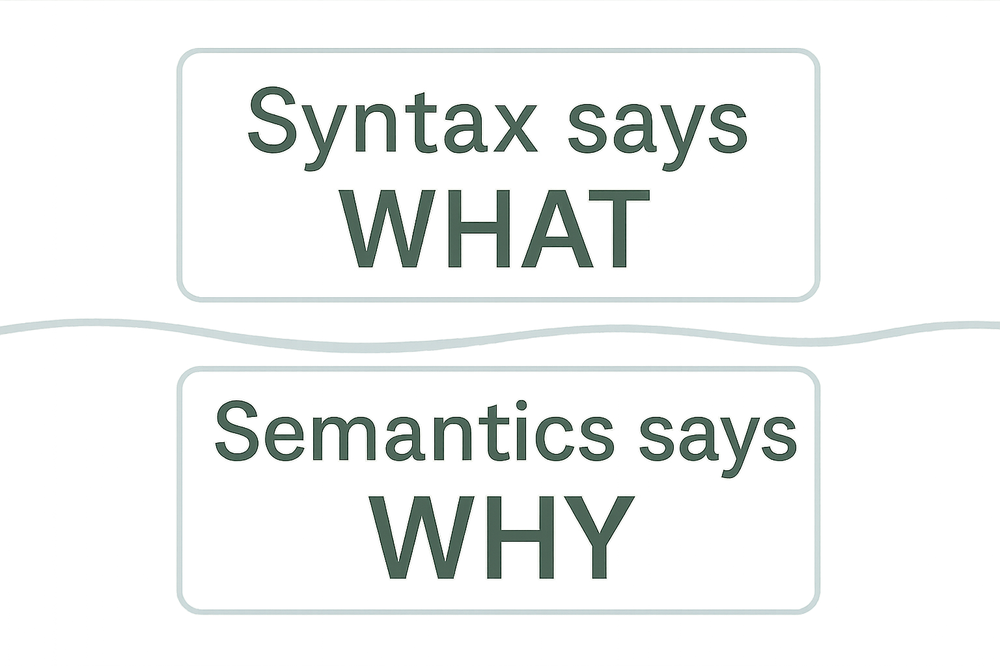

## 1. Syntax and Semantics

Traditional Python docstrings often repeat what the signature or type hints show. They explain *what* a function does, but not *why* or *how* to use it.  

- Syntax shows structure: arguments, types, returns.  
- Semantics show purpose: responsibility, context, intention.  

For example, type hints show a function takes a `User` and a `Decimal`, returning a `Decimal`.

They don’t explain why these inputs matter or what constraints apply. Semantic docstrings fill that gap.

## 2. Benefits for Developers

Semantic docstrings improve workflows by:  
- Speeding onboarding with clear roles and responsibilities.  
- Shifting code reviews to focus on intent, not just code style.  
- Making refactoring safer by preserving original purpose.  
- Reducing the need for separate design docs, keeping knowledge close to code.

## 3. Benefits for LLMs and Code Assistants

Semantic docstrings boost AI-assisted development:  
- Provide context and purpose before implementation details.  
- Reduce ambiguity and incorrect assumptions.  
- Improve code completions aligned with architectural intent.  
- Increase information density, optimizing AI context windows.

## 4. Documentation Quality Threshold

Documentation impact on AI is not linear:  
- High-quality docs improve accuracy by 20–50%.  
- Poor or misleading docs hurt performance more than no docs, sometimes over 60%.  

Focus on accuracy and clarity over quantity. Better to document fewer functions well than many poorly.

## 5. Principles of Semantic Docstrings

Key principles:  
- **Responsibility**: Define clear responsibilities.  
- **Context**: Explain origin, meaning, constraints of inputs and outputs.  
- **Boundaries**: State what the component does *not* do.  
- **Role**: Clarify the system role of classes and modules.  

These ensure docs capture architectural and semantic meaning, not just code details.

## 6. Why Now?

AI-assisted development demands clear documentation.  
- Benchmarks like HumanEval rely on natural language clarity.  
- Semantic docstrings create a shared layer for humans and AI.  
- They enable reasoning about *why* code exists, not just *how*.  

Adopting semantic docstrings improves readability and preps code for AI collaboration.

